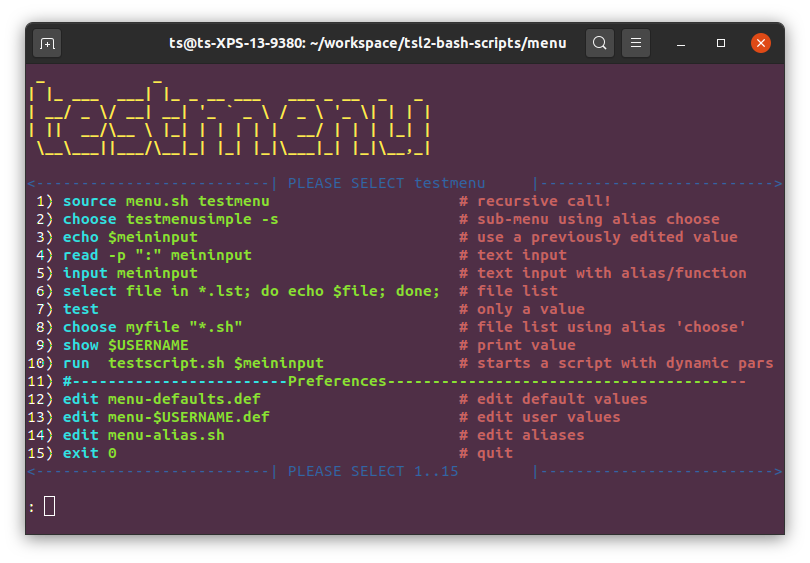

# TSL2 bash scripts

some generic linux bash scripts with as less dependencies as possbile.
each script uses a simple text file to generate informations from

* *readmap.sh*: reads a map of key+values and provides them to the caller
* *pars.sh*   : provides arguments in a map of checked variables - read through a given manual
* *menu.sh*   : simple generic menu using bash _select_ for user interactive shell applications

Please look at the scripts themselves to get futher informations

## The Menu

## The Parameter Parser

## The Map Provider

